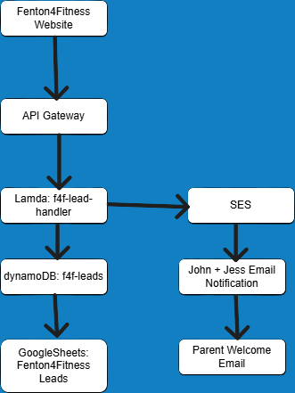

# Project 04 - Fenton4Fitness Lead Capture System

## Overview

This project transforms the Fenton4Fitness website contact form into a complete lead management system built on AWS.

When a parent submits the athlete interest form:

* Lead data is stored in DynamoDB
* Email notifications are sent to the business owners
* Lead information is automatically added to Google Sheets
* A welcome email is sent to the parent

This project demonstrates serverless application development, API integration, data storage, automation, and third-party service integration.

---

## Architecture

Fenton4Fitness Website

↓

Amazon API Gateway

↓

AWS Lambda (f4f-lead-handler)

├── Amazon DynamoDB (Lead Storage)

├── Amazon SES (Email Notifications)

└── Google Sheets Integration (Apps Script Webhook)

---

## Overview

This project transforms the Fenton4Fitness website contact form into a complete lead management system built on AWS.

---

## AWS Services Used

* Amazon API Gateway
* AWS Lambda
* Amazon DynamoDB
* Amazon SES
* IAM
* Amazon CloudWatch

---

## Features

### Lead Storage

All athlete inquiries are stored in DynamoDB for long-term retention.

### Email Notifications

New lead notifications are automatically sent to business owners.

### Google Sheets Integration

Lead information is automatically added to a shared Google Sheet for easy business management.

### Parent Welcome Email

Parents receive an automated welcome email confirming their submission.

---

## Skills Demonstrated

* Serverless Architecture
* REST API Integration
* AWS Lambda Development
* DynamoDB Data Storage
* Email Automation with SES
* CloudWatch Monitoring
* IAM Permissions Management
* Third-Party API Integration
* Business Workflow Automation

---

## Project Status

Completed - June 2026
