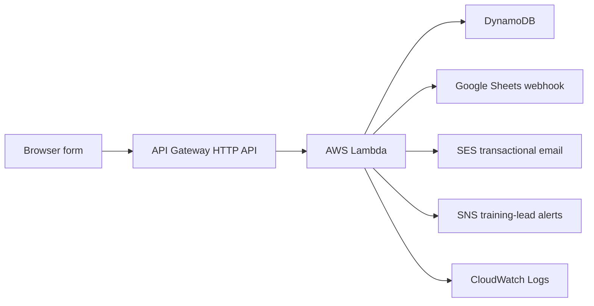
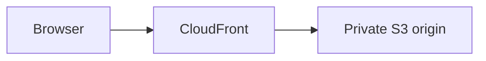

# Fenton4Fitness Serverless Lead Capture

This production serverless application processes form submissions from
[fenton4fitness.com](https://fenton4fitness.com). It demonstrates API design,
event-driven processing, durable storage, transactional email, third-party
automation, least-privilege IAM, observability, and backward-compatible
production repair.

## Production milestone

The repaired lead pipeline launched with the production website on
**July 27, 2026**.

## Architecture



The website itself follows a separate delivery path:



## Supported submissions

| Category | `submissionType` | `leadType` |
|---|---|---|
| Youth athlete | `lead` | `youth-athlete` |
| Adult training | `lead` | `adult-personal-training` |
| Team training | `lead` | `team-training` |
| General inquiry | `lead` | `general-inquiry` |
| Business website inquiry | `website-service-inquiry` | `business-website` |
| Testimonial | `testimonial` | `testimonial` |

Testimonials are persisted for private review only. There is no automatic
publication path.

## Production behavior

- API Gateway accepts JSON through `POST /lead`.
- CORS is restricted to approved production and local-development origins.
- API throttling limits accidental or abusive request bursts.
- Lambda parses API Gateway v2, direct, and base64-encoded request bodies.
- Input validation rejects malformed requests before persistence.
- DynamoDB stores the normalized submission before optional integrations run.
- Google Sheets receives the compatible payload through an Apps Script webhook.
- SES sends the owner notification and customer confirmation independently.
- SNS publishes one concise transactional alert for a newly stored training
  inquiry. Website-service and testimonial submissions do not trigger SMS.
- A conditional DynamoDB write suppresses duplicate downstream deliveries when
  API Gateway retries the same request ID.
- Downstream failures are logged without discarding a stored DynamoDB record.
- Logs avoid private form contents and webhook values.

## Configuration

The Lambda reads these environment-variable names:

- `DYNAMODB_TABLE`
- `GOOGLE_SHEETS_WEBHOOK_URL`
- `OWNER_EMAIL`
- `SES_FROM_EMAIL`
- `SNS_TOPIC_ARN`
- `ALLOWED_ORIGINS`

Only the names belong in source control. Values must remain in Lambda
configuration or an approved AWS secret-management service. Never commit
webhook URLs, credentials, SMTP passwords, form exports, or real customer data.

## Security and operations

- The execution role grants only DynamoDB write access to the lead table and
  SES send access for the approved sender identity. Terraform adds
  `sns:Publish` only for the dedicated training-lead topic.
- DynamoDB point-in-time recovery protects lead storage.
- Lambda logs have a finite retention period.
- The Google Sheets call uses bounded retries and a network timeout.
- The HTTP API uses explicit CORS origins and stage-level throttling.
- The frontend receives a generic success response rather than infrastructure
  details.

## Deployment

Package and deploy only after backing up the current function code and
configuration. Do not print environment variables during diagnostics.

```powershell
python -m py_compile lambda\lambda_function.py

Compress-Archive `
  -Path lambda\lambda_function.py `
  -DestinationPath lambda-package.zip `
  -Force

aws lambda update-function-code `
  --function-name f4f-lead-handler `
  --zip-file fileb://lambda-package.zip `
  --profile YOUR_APPROVED_PROFILE `
  --region us-east-1
```

Environment changes should preserve every existing variable. Use
`scripts/rotate-google-sheets-webhook.ps1` for webhook rotation; it prompts
without echoing the value and removes its temporary file with retry handling.

## Verification and maintenance

1. Run syntax checks before packaging.
2. Submit all six categories with synthetic data labeled safe to delete.
3. Confirm HTTP 200, the expected submission labels, and a unique lead ID.
4. Read each DynamoDB item consistently.
5. Confirm the Sheets webhook and both SES delivery calls were accepted.
6. Review CloudWatch errors, throttling, and SES reputation metrics.
7. Rotate a webhook by creating a new deployment, testing it, and only then
   disabling the previous deployment.
8. Keep production access, sender verification, bounce handling, and complaint
   handling under regular review.
